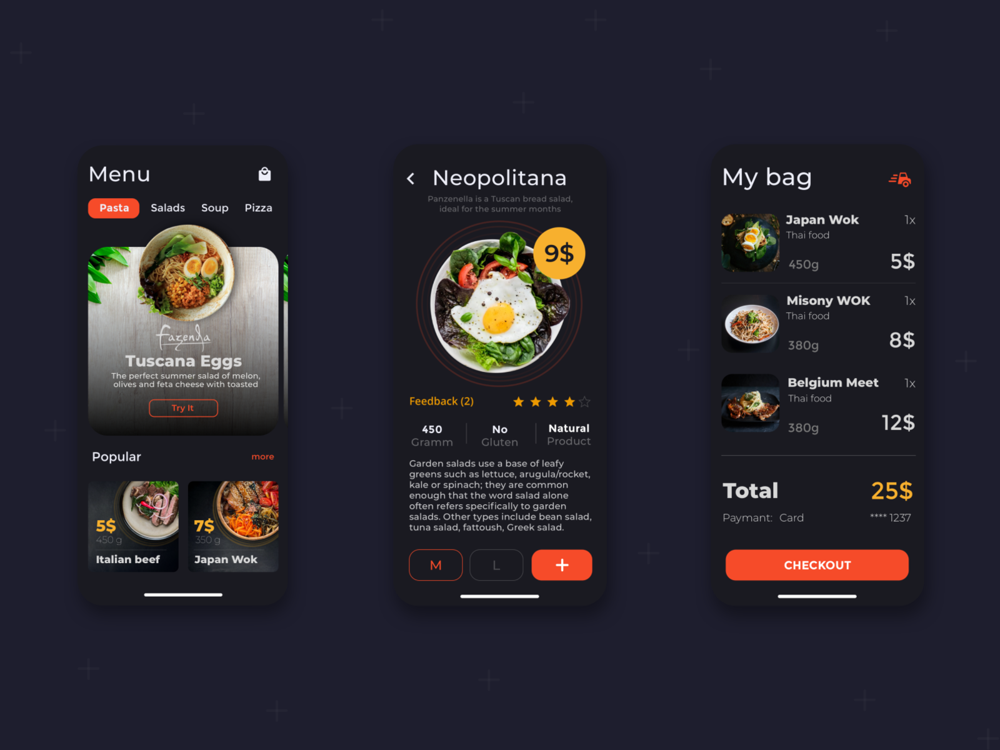

# Task

- create a representation of the UI using html and css only
- Please make sure you follow git flow to ensure you keep to the standard
- always commit a feature once done with it.

## Use this asset 

### colors
- #050407
- #5D5B59
- #455023
- #B0AEA6
- #572712
- #E71407
- #B95820
- #9F8F53

Note: We look oout for thought process, module desgin, organization and simplicity

#### Task duration 2 hours.
